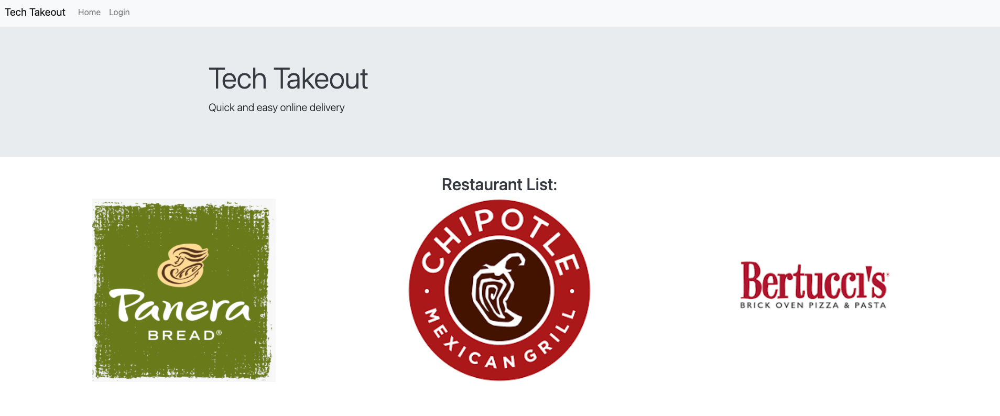
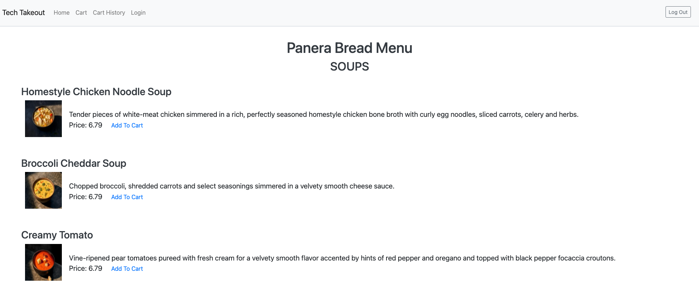
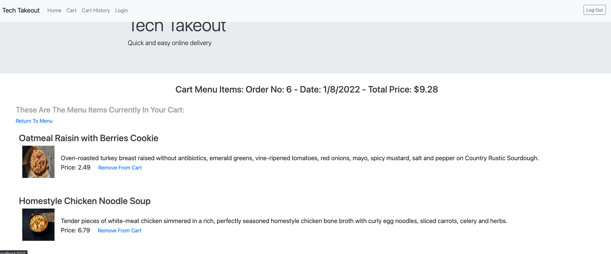
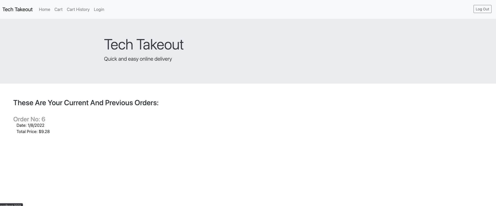
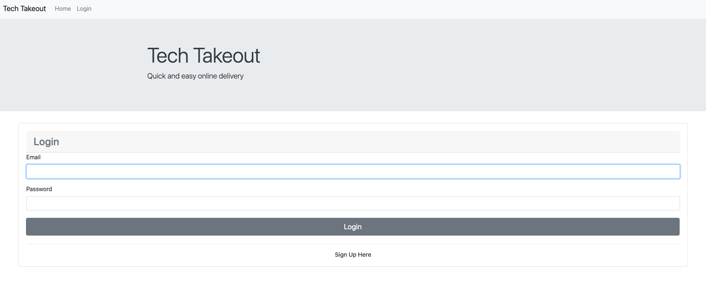

# Project-02 Tech Takeout

## Description
This application is an order online, take out application that shows the user a list of available restaurants, their menus, allows them to add to cart and remove items from cart

## Table of Contents
* [Installation](#installation)
* [Usage](#usage)
* [Functionality](#functionality)
* [Technologies](#technologies)
* [Challenges](#challenges)
* [Links](#links)

## Installation
After cloning the reposititory, a user would start their MySQL database and create the schema by running the following:
```bash
mysql -u root
source db/schema.sql
```
Once that has completed, the user would then execute "quit" in their MySQL window to quit the MySQL process and return to an integrated terminal.

The user would then seed the database (if applicable) by running the following:
```bash
npm run seed
```

They would then start the server by running:
```bash
npm start
```

## Functionality
    The page loads when you open the url
    When you look at the nav bar at the top of the page
    Then you see Home link, Cart link, Cart History link (shows current and previous orders), and Login link.
    When first loaded you are presented with the homepage with a restaurant list
    Then you can browse restaurant menu.
    When you want to order from a menu
    Then a message will tell you to log in or create account.
    When you get to log in page
    Then you can log in with email and password or select "Sign up instead"
    When you get to a sign up page then you sign up with email and password.
    When you click "Add to Cart" on a menu item
    Then you see a message saying what was added, and are presented with a link to return to menu.

## Usage
Select a restaurant and you are presented with a menu. To add items from the menu to your cart, the user must be logged in to the application. After adding items to the cart, the user can return to menu to browse more. Users can login or create an account.

## Technologies
* express.js
* node.js
* passport.js
* passport-local.js
* sequelize
* mysql2
* bcrypt
* .env
* express-handlebars
* express-session
* connect-session_sequelize
    
## Challenges
  * Understanding new branches, pull requests, merging and resolving conflicts
  * Heroku integration

## Links

Click [here](https://tech-takeout.herokuapp.com/) to go to my deployed page.

Pictures of my Site in action:
Homepage:

Menu:

Cart:

Cart History:

Login/Signup:
